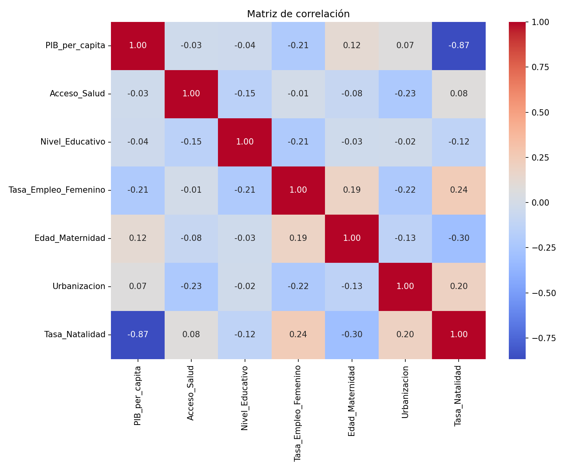
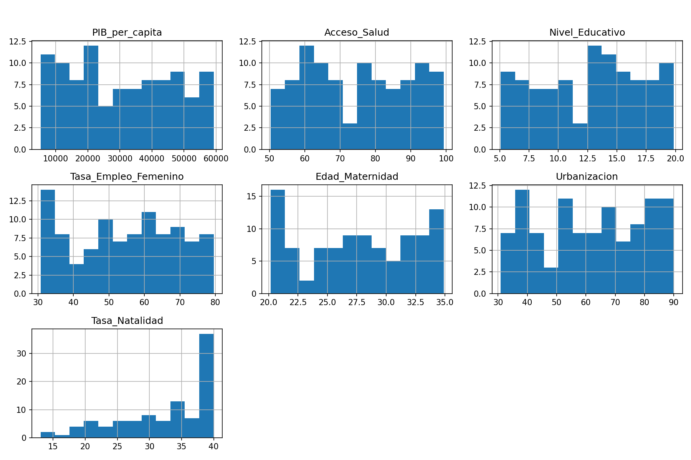
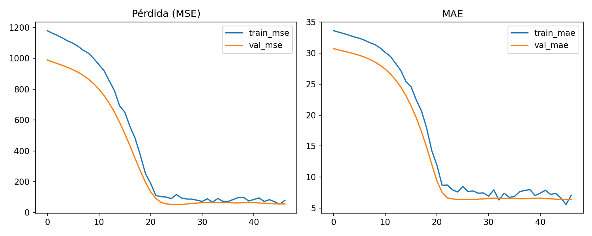
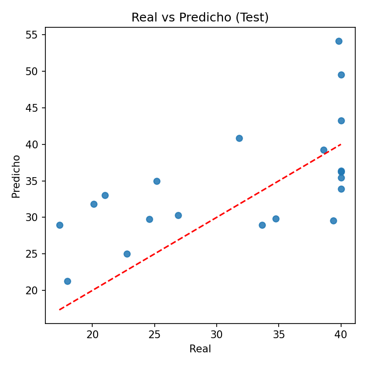
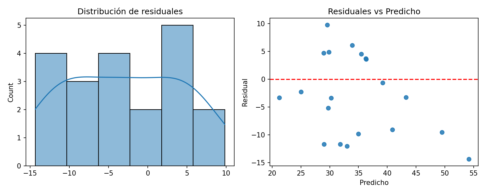
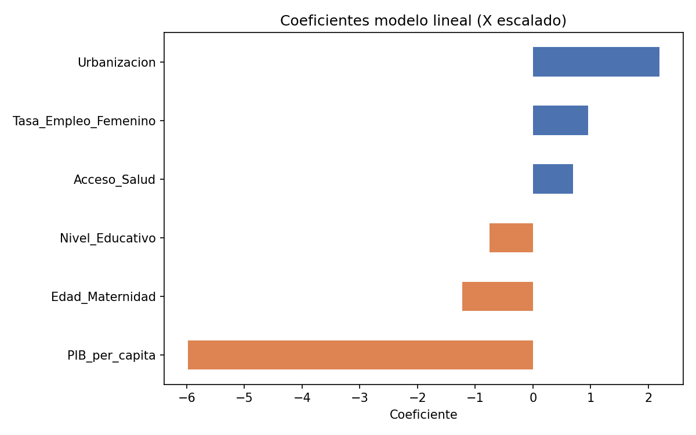
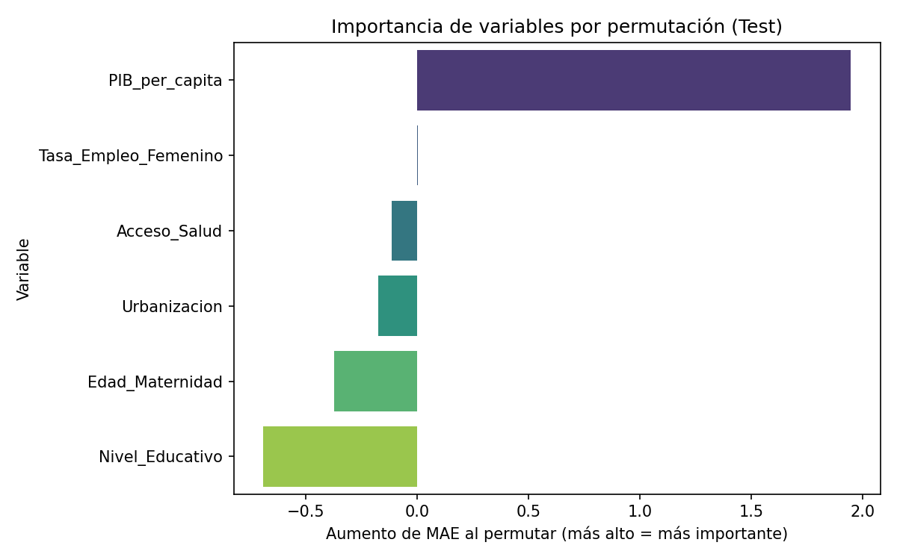
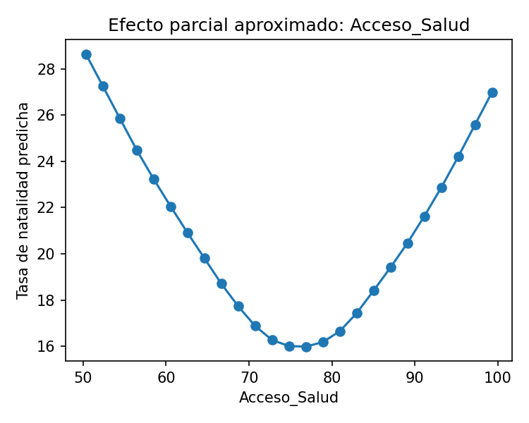
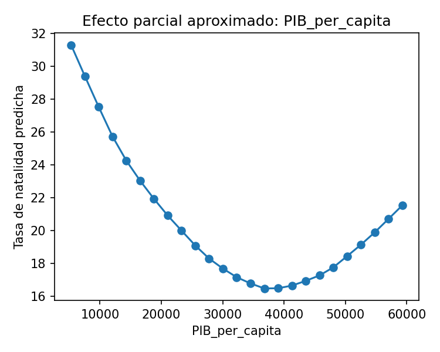
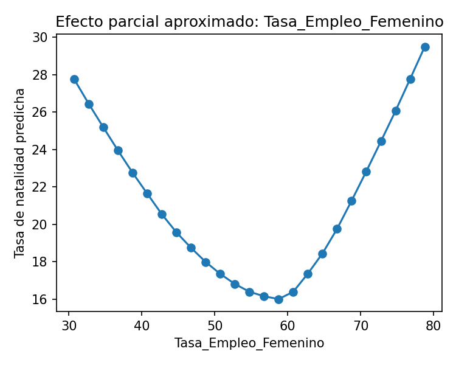

# 🧠 Predicción de Natalidad según Factores Socioeconómicos

Este proyecto fue desarrollado como parte de una evaluación final en el contexto de investigación demográfica. El objetivo principal fue construir un modelo predictivo basado en redes neuronales para estimar la tasa de natalidad en distintos países, utilizando variables socioeconómicas como el PIB per cápita, acceso a salud, educación, empleo femenino, urbanización y edad promedio de maternidad.

---

## 🎯 Objetivos del Proyecto

- Diseñar y entrenar una red neuronal para resolver un problema de regresión.
- Aplicar funciones de activación, optimizadores y estrategias de regularización para evitar sobreajuste.
- Evaluar múltiples configuraciones del modelo y seleccionar la más precisa.
- Analizar la influencia de cada variable en la predicción y extraer conclusiones sobre patrones demográficos globales.

---

## 🛠️ Tecnologías y Herramientas

- Python 3.10  
- Pandas, NumPy, Matplotlib, Seaborn  
- Scikit-learn, TensorFlow (Keras)  
- Técnicas aplicadas:  
  - Regularización (Dropout, L2)  
  - Permutation Importance  
  - Regresión lineal interpretativa  
  - Visualización de efectos marginales  

---

## 📁 Estructura del Proyecto

```text
Predicción-Natalidad-segun-Factores-Socioeconómicos/
consolidado/
├── consolidado.py                  # Script principal: carga de datos, entrenamiento y evaluación de modelos
├── dataset_natalidad.csv          # Dataset base con variables socioeconómicas por país
├── resultados/                    # Métricas, coeficientes y reflexiones del modelo
│   ├── 2_resultados_configs.csv       # Comparativa de configuraciones probadas
│   ├── 3_metricas_finales.json        # Métricas del mejor modelo seleccionado
│   ├── 3_predicciones_test.csv        # Predicciones vs valores reales en test
│   ├── 4_importancia_permutacion.csv # Importancia de variables según permutación
│   ├── 4_coeficientes_lineal.csv     # Coeficientes del modelo lineal
│   └── 5_reflexion_operativa.json    # Reflexión final y propuestas de mejora
├── figuras/                      # Visualizaciones generadas durante el análisis
│   ├── 1_correlacion.png             # Mapa de correlación entre variables
│   ├── 1_distribuciones.png          # Distribución de variables clave
│   ├── 2_curvas_entrenamiento.png    # Curvas de pérdida durante el entrenamiento
│   ├── 3_real_vs_predicho.png        # Comparación entre valores reales y predichos
│   ├── 3_residuales.png              # Análisis de residuos del modelo
│   ├── 4_importancia_permutacion.png # Gráfico de importancia de variables
│   ├── 4_coefs_lineal.png            # Coeficientes del modelo lineal
│   └── 4_parcial_.png                # Visualizaciones parciales por variable

## 🔍 Metodología

### 1. Carga y exploración de datos
- Análisis de correlaciones entre variables.
- Visualización de distribuciones numéricas.
- Preparación de datos para modelado (escalado, separación de conjuntos).

### 2. Diseño y entrenamiento del modelo
- Red neuronal con:
  - Capa de entrada según número de variables predictoras.
  - Mínimo 2 capas ocultas con activaciones `relu`, `tanh` y `selu`.
  - Regularización con `Dropout` y `L2`.
  - Optimización con `Adam` y `RMSprop`.
- Comparación de 5 configuraciones distintas.

### 3. Evaluación y análisis
- Métricas: MAE, RMSE, R².
- Importancia de variables mediante permutación.
- Interpretabilidad con regresión lineal.
- Visualización de efectos marginales para las variables más influyentes.

### 4. Reflexión final
- Identificación de variables clave: educación, urbanización, edad de maternidad.
- Relación con tendencias demográficas globales.
- Propuestas de mejora: modelos alternativos, explicabilidad avanzada (SHAP), series temporales.

---

## 📊 Resultados Destacados


| Métrica        | Valor     | Interpretación                                                                 |
|----------------|-----------|--------------------------------------------------------------------------------|
| MAE (Error Absoluto Medio) | 4.84      | En promedio, el modelo se equivoca en ~4.84 unidades de natalidad.         |
| RMSE (Raíz del Error Cuadrático Medio) | 5.72      | Penaliza más los errores grandes. Buen indicador de precisión general.     |
| R² (Coeficiente de Determinación)      | 0.545     | El modelo explica el 54.5% de la variabilidad en la tasa de natalidad.     |
| Mejor Configuración                    | relu + adam + lr=0.001 + dropout=0.3 | Combinación óptima para este dataset. |
| Variables más influyentes              | PIB_per_capita, Urbanización, Empleo Femenino | Factores clave en la predicción. |
> Las variables más influyentes fueron aquellas relacionadas con educación, urbanización y edad promedio de maternidad, alineadas con patrones globales de natalidad.

---
#### 📷 Gráficos generados

<table>
  <tr>
    <td></td>
    <td></td>
    <td></td>
    <td></td>
  </tr>
  <tr>
    <td></td>
    <td></td>
    <td></td>
    <td></td>
  </tr>
  <tr>
    <td></td>
    <td></td>
  </tr>
</table>
## 🚀 Propuestas de Mejora

- Incorporar datos longitudinales y políticas públicas.
- Validación cruzada y búsqueda bayesiana de hiperparámetros.
- Comparación con modelos de árbol (XGBoost, RandomForest).
- Aplicar técnicas de explicabilidad como SHAP y estimación de incertidumbre.

---

## 👩‍💻 Autora

**Vanessa Morales Norambuena **  
Creadora y estratega digital con formación en ciencia de datos, machine learning aplicado y gestión de proyectos.  
Especializada gestión de proyectos.

---

## 📌 Artefactos Generados

- Visualizaciones: correlaciones, distribuciones, curvas de entrenamiento, residuales, efectos marginales.
- Métricas exportables en `.csv` y `.json`.
- Modelos entrenados y guardados en formato `.keras`.
- Reflexión operativa documentada para transferencia grupal.

